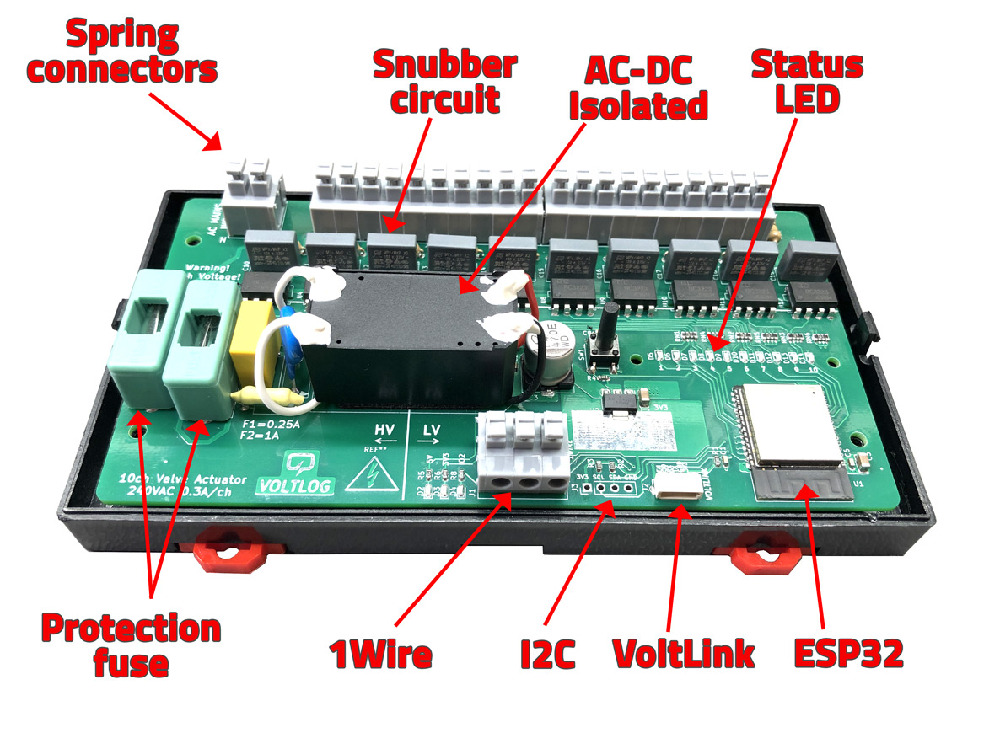

# 10ch Valve Actuator (Tasmota compatible)
I designed this 10 channel valve actuator board to be able to control up to 10 electrical valve actuators for my floor heating system. It is based on an ESP32 which makes it Tasmota/MQTT compatible and this allows me to easily integrate it into my HomeaAssistant server. For more information check out [Voltlog #383](https://youtu.be/kZS3ggG0QJI).

To flash the ESP32 you can use a VoltLink usb/serial converter or you can use your own usb-serial converter module through the on-board JST-SH 1.0mm pitch 6 pin connector. After loading the initial firmware, you can update the firmware via OTA. 

If you would like to order one of these boards ready assembled, check out my [Tindie store](https://www.tindie.com/products/voltlog/tasmota-esp32-floor-heating-valve-controller/).

## Tasmota template
Use this template to configure tasmota for this board `{"NAME":"Voltlog Valve Actuator","GPIO":[1,3200,288,3232,1,1,1,1,1,229,1,1,228,227,226,225,0,1,1,224,0,232,231,230,0,0,0,0,233,32,1,1,1,0,0,1],"FLAG":0,"BASE":1}`

### Known issues in revA
#1 :exclamation: [As reported here](https://github.com/voltlog/Valve-Actuator/issues/1), AC mains input connector (J6) has the silkscreen labels for live and neutral reversed. While the board will still operate if you connect these reversed, in case of faults when the fuse blows, you will still have mains voltages present on the board. As a workaround, please connect live wire to point marked ```N``` on J6 and neutral wire to point marked ```L```.

~~#2 Starting with Tasmota releases newer than v9.5.0 Tasmota started using IO16, IO17 to connect to external PSRAM and due to the way Tasmota implements this, it continuously  tries to talk to the external PSRAM, without considering the type of hardware, whether it contains any PSRAM or not. As a consequence, IO16, IO17 will show constant SPI traffic so IT IS RECOMMENDED YOU FLASH REV.A HW WITH TASMOTA V9.5.0 MAX!~~ This issue appears to have been addressed in commit [72083d3](https://github.com/arendst/Tasmota/commit/72083d34a71358ce57cc617acf458a57df6f5f50 "72083d3"), still pending verification on my end.

#3 The footprint for the dc-dc module PS1 mirrored which means the part cannot be soldered directly to the PCB. A workaround is to position the part up-side down and solder wires as shown in Voltlog #383.

*both of these issues will be addressed in revB.


